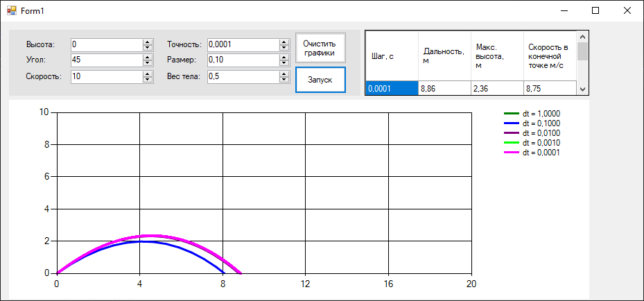

### Моделирование полёта тела в атмосфере

**Задание:**  
Реализовать приложение для моделирования полёта тела в атмосфере.  
Предусмотреть возможность ввода шага моделирования и вывода результатов.

Выполнить моделирование **без очистки предыдущих результатов** для различных шагов моделирования, сравнить траектории и заполнить таблицу:

| Шаг моделирования, с | 1 | 0.1 | 0.01 | 0.001 | 0.0001 |
|----------------------|---|-----|------|-------|--------|
| Дальность полёта, м |   |     |      |       |        |
| Максимальная высота, м | | | | | |
| Скорость в конечной точке, м/с | | | | | |

**Сделать выводы.**

**В отчёт включить:**
- код программы;
- скриншот с несколькими траекториями;
- заполненную таблицу;
- выводы.

# Лабораторная работа: Моделирование полёта тела в атмосфере

**Параметры модели:**
- Начальная высота: `0 м`
- Угол броска: `45°`
- Начальная скорость: `10 м/с`
- Масса тела: `0.5 кг`
- Размер: `0.10 м²`

---

График при разной точности:

 - Точность 1

---

## Результаты моделирования

| Шаг моделирования, с | 1.0000 | 0.1000 | 0.0100 | 0.0010 | 0.0001 |
|----------------------|--------|--------|--------|--------|--------|
| **Дальность полёта, м**   | 5.70   | 8.27   | 8.82   | 8.86   | 8.86   |
| **Макс. высота, м**       | 0.00   | 1.99   | 2.32   | 2.36   | 2.36   |
| **Скорость в конечной точке, м/с** | 10.00  | 7.77   | 8.66   | 8.75   | 8.75   |

---

## Выводы

1. **Сходимость решения**:  
   При уменьшении шага интегрирования `dt` результаты быстро сходятся:
   - Дальность полёта стабилизируется на уровне **≈8.86 м** при `dt ≤ 0.001`.
   - Максимальная высота — **≈2.36 м**.
   - Конечная скорость — **≈8.75 м/с**.

2. **Влияние шага на точность**:  
   - При `dt = 1` результаты **недостоверны**: траектория сильно искажена (дальность занижена в 1.5 раза, высота ≈0 — модель «пропускает» подъём).
   - При `dt = 0.1` уже видна качественная траектория, но значения всё ещё отличаются от предельных на ~5–7%.
   - При `dt ≤ 0.01` ошибка становится менее 1% — достаточна для учебных целей.

3. **Физическая интерпретация**:  
   Сопротивление воздуха существенно снижает дальность полёта по сравнению с идеальным случаем (без сопротивления).  
   Также наблюдается **асимметрия траектории**: спуск происходит быстрее подъёма из-за роста силы сопротивления с увеличением скорости.

---
