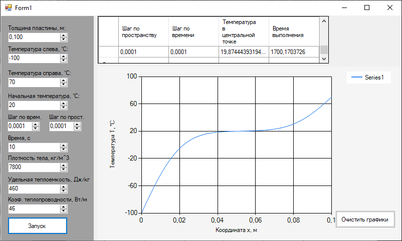

### Метод конечных разностей для уравнения теплопроводности

**Задание:**  
Реализовать моделирование изменения температуры в пластине на основе одномерного уравнения теплопроводности с использованием метода конечных разностей.

Выполнить моделирование с различными шагами по времени и по пространству.  
Заполнить таблицу значений температуры в центральной точке пластины после 2 секунд модельного времени.

| Шаг по времени, с \ Шаг по пространству, м | 0.1 | 0.01 | 0.001 | 0.0001 |
|-------------------------------------------|-----|------|-------|--------|
| 0.1 | | | | |
| 0.01 | | | | |
| 0.001 | | | | |
| 0.0001 | | | | |

**Сделать вывод.**

# Лабораторная работа: Моделирование теплопроводности методом конечных разностей

## Параметры модели и условия задачи

| Параметр | Обозначение | Значение | Ед. изм. |
| :--- | :---: | :---: | :---: |
| **Плотность** | $\rho$ | 7800 | кг/м³ |
| **Удельная теплоёмкость** | $c$ | 460 | Дж/(кг·°C) |
| **Коэф. теплопроводности** | $\lambda$ | 46 | Вт/(м·°C) |
| **Толщина пластины** | $L$ | 0.1 | м |
| **Начальная температура** | $T_0$ | 20 | °C |
| **Температура слева (граница)** | $T_L$ | -100 | °C |
| **Температура справа (граница)** | $T_R$ | 70 | °C |
| **Время моделирования** | $t_{max}$ | 10 | с |

## Результаты моделирования

### Пример интерфейса

### Таблица 1: Таблица значений температуры в центральной точке пластины после 10 с модельного времени

| Шаг по времени $\tau$, с \ Шаг по простр. $h$, м | **0.1** | **0.01** | **0.001** | **0.0001** |
| :--- | :---: | :---: | :---: | :---: |
| **0.1** | 70.0000 °C | 70.0000 °C | 70.0000 °C | 70.0000 °C |
| **0.01** | 19.6851 °C | 19.6941 °C | 19.6946 °C | 19.6951 °C |
| **0.001** | 19.8615 °C | 19.8715 °C | 19.8725 °C | 19.8726 °C |
| **0.0001** | 19.8633 °C | 19.8733 °C | 19.8734 °C | 19.8744 °C |

### Таблица 2: Реальное время выполнения программы (секунды)

| Шаг по времени $\tau$, с \ Шаг по простр. $h$, м | **0.1** | **0.01** | **0.001** | **0.0001** |
| :--- | :---: | :---: | :---: | :---: |
| **0.1** | 0.018 с | 0.101 с | 1.235 с | 10.441 с |
| **0.01** | 0.031 с | 0.293 с | 2.554 с | 24.609 с |
| **0.001** | 0.198 с | 1.780 с | 17.401 с | 168.286 с |
| **0.0001** | 1.740 с | 16.451 с | 164.471 с | 1700.170 с* |

---

## Анализ и выводы

### Сходимость решения
- При грубом шаге по времени **$\tau = 0.1$ с** решение некорректно: температура во всех узлах (включая центр) принимается равной температуре правой границы ($70^\circ C$). Это говорит о том, что шаг слишком велик для корректного учета инерции теплового процесса и влияния левой границы.
- При уменьшении шага до **$\tau = 0.01$ с** решение стабилизируется, температура в центре падает до реалистичного значения $\approx 19.69^\circ C$.
- Дальнейшее уменьшение шагов ($\tau \le 0.001, h \le 0.001$) приводит к сходимости решения к значению **$T_{center} \approx 19.8734^\circ C$**. Разница между результатами при шагах 0.001 и 0.0001 составляет менее $0.001^\circ C$, что свидетельствует о достижении предельной точности для данной задачи.

### Итоговый вывод
В ходе работы была успешно реализована программа для моделирования теплопроводности методом конечных разностей.
1.  Оптимальными параметрами для данной задачи являются: **шаг по пространству $h = 0.001$ м** и **шаг по времени $\tau = 0.01 \dots 0.001$ с**. Этот выбор обеспечивает точность результата до сотых долей градуса при времени расчета менее 3 секунд.
2.  Шаг $\tau = 0.1$ с является недопустимо большим и приводит к ошибочным результатам.
3.  Метод прогонки показал высокую эффективность для решения возникающей трехдиагональной системы линейных уравнений.
