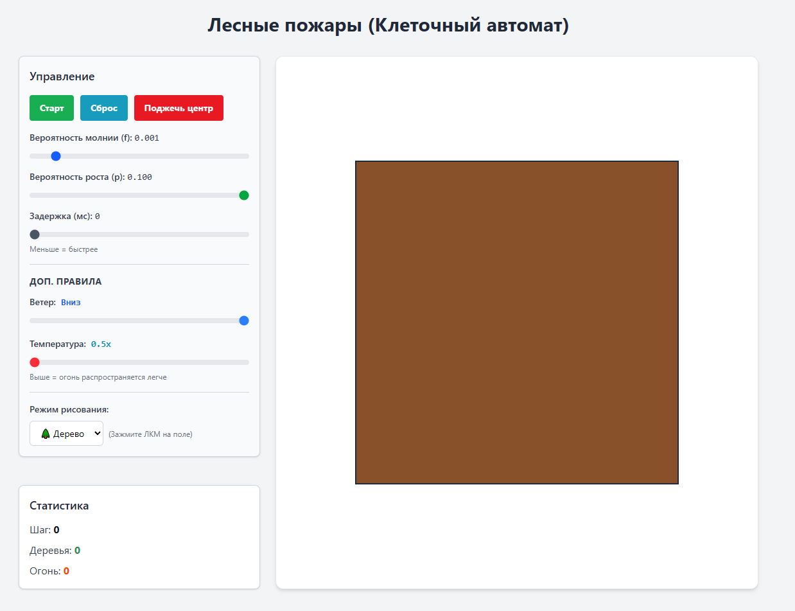

### Клеточные автоматы. Лесные пожары

**Задание:**  
Реализовать моделирование возникновения и распространения лесных пожаров с использованием двумерного клеточного автомата.

**Требования:**
- реализовать **не менее трёх дополнительных правил** поведения системы.

### Отчет

**Вид интерфейса**

**Доп. правила**
- Ветер (Право, Лево, Верх, Низ)
- Преграды (Вода), можно расставить по сетке
- Температура ( меньше 1.0; больше 1.0)
